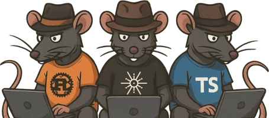

# RATTS

`RATTS` is a DevOps ready, starter web application featuring <u>stateless JWT authentication</u> and
<u>deferred persistence user registration</u>, written in [`Rust`] with [`axum`], [`tokio`], [`SQLx`], [`argon2`], and
[`lettre`].
It features an [`Angular`] frontend with a clear public/private split, mirroring the structure of modern web applications.
On the backend, [`PostgreSQL`] provides persistence with a dedicated `user` table and full migration support.

---

<p align="center"></p>
<p align="center">
  made with <u>R</u>ust, <u>A</u>xum and <u>T</u>okio, supporting any <u>T</u>ype<u>S</u>cript UI
</p>

---

Deploy it locally with [`Docker`]

```bash
git clone https://github.com/gameinstance/ratts.git
cd ratts
cp -v .env.template .env
docker compose up --build
```
and test it on [http://localhost:3000](http://localhost:3000), _checking_ emails with mailcatcher at
[http://localhost:1080](http://localhost:1080).

---

[](https://www.rust-lang.org/)
[](https://angular.io/)
[](https://www.typescriptlang.org/)
[](https://www.postgresql.org/)
[](https://www.docker.com/)
[](LICENSE)

**Minimum requirement**: [`Docker`], optionally: [`Rust`] (1.80+) and [`Node.js`] (v18+).

## Description

RATTS implements a stateless-first REST architecture: all regular requests are handled without server-side session storage.
The backend handles API requests from `/api` and serves files located in ./static from the webserver root.

The frontend is technology-flexible, with [`Angular`] as the default, but any [`TypeScript`] framework can plug in seamlessly
thanks to strongly-typed API contracts generated with **ts-rs**.

The repo comes with a multi-stage `Dockerfile` that builds the backend, the frontend and then packs the deployment image.
The `docker compose` setup will build, if needed, and run the web application image. It fetches, initiates and runs
the official **PostgreSQL** Docker image with storage volume. For testing purposes, a demo SMTP **mailcatcher** is
launched to capture and display the emails sent by the webserver.

## Reuse

To start your next application using RATTS, you must first change the credentials in `.env` and configure an actual
SMTP server. You can then extend and improve it to your requirements. As an MIT creation, you are free to rebrand it.

```bash
cd ratts
sed -i 's/ratts/your_awesome_project/g' *
sed -i 's/RATTS/YourAwesomeProject/g' *
```


## Features

- **Authentication**
  - JWT-based login
  - Argon2id password hashing
  - Short-lived access tokens
- **Registration flow**
  - Email verification with short TTL token
  - Deferred persistence user registration
- **Security**
  - Angular route guards for protected pages
  - Minimal and generic responses on failures
- **User area**
  - Public pages (home, about, login, register)
  - Private dashboard (accessible only after login)
- **DevOps ready**
  - Docker compose for build and deployment

---

## License

[`License: MIT`] - feel free to use this as a starting point for your own projects.

---

[`Rust`]: https://www.rust-lang.org/
[`axum`]: https://github.com/tokio-rs/axum
[`tokio`]: https://github.com/tokio-rs/tokio
[`SQLx`]: https://github.com/launchbadge/sqlx/
[`argon2`]: https://docs.rs/argon2/latest/argon2/
[`lettre`]: https://github.com/lettre/lettre
[`PostgreSQL`]: https://www.postgresql.org/
[`Node.js`]: https://nodejs.org/
[`TypeScript`]: https://www.typescriptlang.org/
[`Angular`]: https://angular.io/
[`Docker`]: https://www.docker.com/
[`License: MIT`]: https://mit-license.org/
